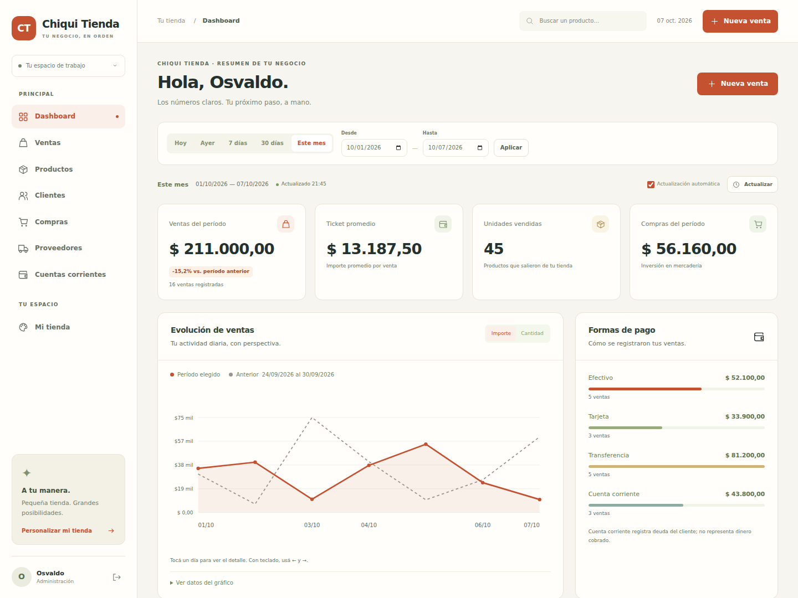

# Chiqui Tienda

Aplicación de gestión de tienda en **Laravel 12**, con interfaz adaptable a celular y escritorio.

Repositorio: [osvaldoschenkel/chiqui_tienda](https://github.com/osvaldoschenkel/chiqui_tienda).



Vista con datos de ejemplo. [Ver interfaz móvil](docs/images/dashboard-mobile.png) · [Personalizar la tienda](docs/images/store-settings.png).

## Incluye

- Alta, consulta, modificación y eliminación de productos, clientes y proveedores.
- Imágenes, SKU, categorías, costos, precios, stock y mínimos.
- Cuenta corriente de clientes y proveedores: cargos, cobranzas, pagos y saldo.
- Ventas con carrito, comprobante interno e impresión.
- Compras que reponen stock y registran deuda con el proveedor cuando corresponde.
- Anulaciones con reversión de stock y cuenta corriente.
- Dashboard dinámico con filtros de fecha, evolución de ventas, comparación con el período anterior, productos más vendidos y medios de pago.
- Personalización de nombre, frase, logo y color desde «Mi tienda», aplicada a navegación, ingreso y comprobantes.
- Búsqueda, paginación, login y protección de formularios.
- Roles de administrador y cliente, con permisos comprobados en el servidor.
- Portal cliente `/tienda`, carrito y compras propias en `/mis-compras`.
- Pedidos de clientes con reserva de stock, cancelación y registro manual del pago.
- Importes en centavos enteros y operaciones dentro de transacciones.
- Suite de pruebas y flujo de GitHub Actions.

## Inicio

Requiere PHP 8.2+ y Composer 2. La interfaz no necesita npm.

```bash
composer setup
php artisan admin:create admin@tutienda.com --name="Administrador"
php artisan customer:create cliente@tutienda.com --name="Cliente"
php artisan serve
```

Crear un administrador mediante consola; la contraseña se pide oculta. No se publica una cuenta ni contraseña predeterminada.

El administrador ingresa a la gestión y el cliente al catálogo. Las cuentas existentes antes de la migración de roles conservan su acceso de administración; las cuentas nuevas tienen rol cliente por defecto. Ver [flujo de cliente y permisos](docs/FLUJO_CLIENTE.md).

## Documentación

- [Instalación local, Laragon, MySQL y producción](docs/INSTALACION.md)
- [Uso: stock, ventas, compras y cuentas corrientes](docs/USO.md)
- [Arquitectura, datos y alcance](docs/ARQUITECTURA.md)
- [Resultados y alcance de la validación](docs/VALIDACION.md)
- [Dashboard y personalización visual](docs/DASHBOARD.md)
- [Portal cliente, pedidos y permisos](docs/FLUJO_CLIENTE.md)

## Pruebas

```bash
php artisan test
php artisan view:cache
```

Los comprobantes son internos. Tarjetas y transferencias registran un pago realizado por fuera del sistema; no incluyen pasarela de cobro. Para emitir comprobantes fiscales se necesita integrar ARCA.

Base inicial: esqueleto oficial `laravel/laravel`, rama `12.x`, bajo licencia MIT. Ver [LICENSE](LICENSE).
